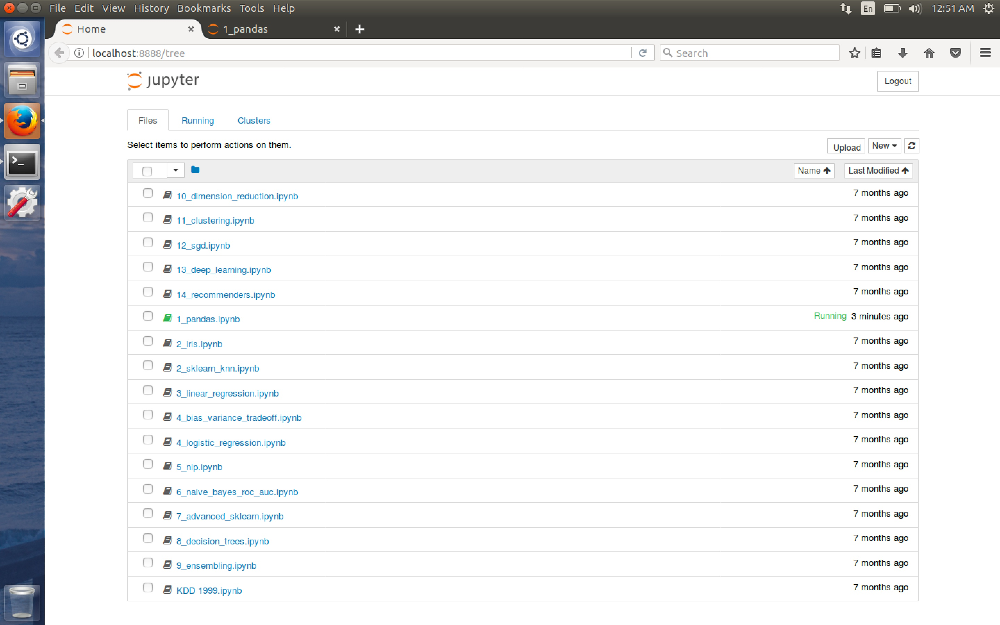

#### 2. Lab Setup and Installation

[```anaconda```](https://www.anaconda.com/download/)

```sh
u64@u64-VirtualBox:~/Downloads$ ls
Anaconda2-4.4.0-Linux-x86_64.sh
u64@u64-VirtualBox:~/Downloads$
```

```sh
u64@u64-VirtualBox:~/Downloads$ chmod +x Anaconda2-4.4.0-Linux-x86_64.sh
```

```sh
u64@u64-VirtualBox:~/Downloads$ ./Anaconda2-4.4.0-Linux-x86_64.sh

Welcome to Anaconda2 4.4.0 (by Continuum Analytics, Inc.)

In order to continue the installation process, please review the license
agreement.
Please, press ENTER to continue
>>>
===================================
Anaconda End User License Agreement
===================================

Copyright 2017, Continuum Analytics, Inc.

All rights reserved under the 3-clause BSD License:

Redistribution and use in source and binary forms, with or without
modification, are permitted provided that the following conditions are met:

* Redistributions of source code must retain the above copyright notice,
this list of conditions and the following disclaimer.
* Redistributions in binary form must reproduce the above copyright notice,
this list of conditions and the following disclaimer in the documentation
and/or other materials provided with the distribution.
* Neither the name of Continuum Analytics, Inc. ("Continuum") nor the names
of its contributors may be used to endorse or promote products derived from
this software without specific prior written permission.

THIS SOFTWARE IS PROVIDED BY THE COPYRIGHT HOLDERS AND CONTRIBUTORS "AS IS"
AND ANY EXPRESS OR IMPLIED WARRANTIES, INCLUDING, BUT NOT LIMITED TO, THE
IMPLIED WARRANTIES OF MERCHANTABILITY AND FITNESS FOR A PARTICULAR PURPOSE
ARE DISCLAIMED. IN NO EVENT SHALL CONTINUUM ANALYTICS, INC. BE LIABLE FOR
ANY DIRECT, INDIRECT, INCIDENTAL, SPECIAL, EXEMPLARY, OR CONSEQUENTIAL
DAMAGES (INCLUDING, BUT NOT LIMITED TO, PROCUREMENT OF SUBSTITUTE GOODS OR
SERVICES; LOSS OF USE, DATA, OR PROFITS; OR BUSINESS INTERRUPTION) HOWEVER
CAUSED AND ON ANY THEORY OF LIABILITY, WHETHER IN CONTRACT, STRICT
LIABILITY, OR TORT (INCLUDING NEGLIGENCE OR OTHERWISE) ARISING IN ANY WAY
OUT OF THE USE OF THIS SOFTWARE, EVEN IF ADVISED OF THE POSSIBILITY OF SUCH
DAMAGE.


Notice of Third Party Software Licenses
=======================================

Anaconda contains open source software packages from third parties. These
are available on an "as is" basis and subject to their individual license
agreements. These licenses are available in Anaconda or at
http://docs.continuum.io/anaconda/pkg-docs . Any binary packages of these
third party tools you obtain via Anaconda are subject to their individual
licenses as well as the Anaconda license. Continuum Analytics ("Continuum")
reserves the right to change which third party tools are provided in
Anaconda.

In particular, Anaconda contains re-distributable, run-time, shared-library
files from the Intel(TM) Math Kernel Library ("MKL binaries"). You are
specifically authorized to use the MKL binaries with your installation of
Anaconda. You are also authorized to redistribute the MKL binaries with
Anaconda or in the conda package that contains them. Use and redistribution
of the MKL binaries are subject to the licensing terms located at
https://software.intel.com/en-us/license/intel-simplified-software-license.
If needed, instructions for removing the MKL binaries after installation of
Anaconda are available at http://www.continuum.io.


Do you approve the license terms? [yes|no]
>>> yes

Anaconda2 will now be installed into this location:
/home/u64/anaconda2

  - Press ENTER to confirm the location
  - Press CTRL-C to abort the installation
  - Or specify a different location below

[/home/u64/anaconda2] >>>
PREFIX=/home/u64/anaconda2
installing: python-2.7.13-0 ...
installing: _license-1.1-py27_1 ...
installing: alabaster-0.7.10-py27_0 ...
installing: anaconda-client-1.6.3-py27_0 ...
installing: anaconda-navigator-1.6.2-py27_0 ...
installing: anaconda-project-0.6.0-py27_0 ...
installing: asn1crypto-0.22.0-py27_0 ...
installing: astroid-1.4.9-py27_0 ...
installing: astropy-1.3.2-np112py27_0 ...
installing: babel-2.4.0-py27_0 ...
installing: backports-1.0-py27_0 ...
installing: backports_abc-0.5-py27_0 ...
installing: beautifulsoup4-4.6.0-py27_0 ...
installing: bitarray-0.8.1-py27_0 ...
installing: blaze-0.10.1-py27_0 ...
installing: bleach-1.5.0-py27_0 ...
installing: bokeh-0.12.5-py27_1 ...
installing: boto-2.46.1-py27_0 ...
installing: bottleneck-1.2.1-np112py27_0 ...
installing: cairo-1.14.8-0 ...
installing: cdecimal-2.3-py27_2 ...
installing: cffi-1.10.0-py27_0 ...
installing: chardet-3.0.3-py27_0 ...
installing: click-6.7-py27_0 ...
installing: cloudpickle-0.2.2-py27_0 ...
installing: clyent-1.2.2-py27_0 ...
installing: colorama-0.3.9-py27_0 ...
installing: configparser-3.5.0-py27_0 ...
installing: contextlib2-0.5.5-py27_0 ...
installing: cryptography-1.8.1-py27_0 ...
installing: curl-7.52.1-0 ...
installing: cycler-0.10.0-py27_0 ...
installing: cython-0.25.2-py27_0 ...
installing: cytoolz-0.8.2-py27_0 ...
installing: dask-0.14.3-py27_1 ...
installing: datashape-0.5.4-py27_0 ...
installing: dbus-1.10.10-0 ...
installing: decorator-4.0.11-py27_0 ...
installing: distributed-1.16.3-py27_0 ...
installing: docutils-0.13.1-py27_0 ...
installing: entrypoints-0.2.2-py27_1 ...
installing: enum34-1.1.6-py27_0 ...
installing: et_xmlfile-1.0.1-py27_0 ...
installing: expat-2.1.0-0 ...
installing: fastcache-1.0.2-py27_1 ...
installing: flask-0.12.2-py27_0 ...
installing: flask-cors-3.0.2-py27_0 ...
installing: fontconfig-2.12.1-3 ...
installing: freetype-2.5.5-2 ...
installing: funcsigs-1.0.2-py27_0 ...
installing: functools32-3.2.3.2-py27_0 ...
installing: futures-3.1.1-py27_0 ...
installing: get_terminal_size-1.0.0-py27_0 ...
installing: gevent-1.2.1-py27_0 ...
installing: glib-2.50.2-1 ...
installing: greenlet-0.4.12-py27_0 ...
installing: grin-1.2.1-py27_3 ...
installing: gst-plugins-base-1.8.0-0 ...
installing: gstreamer-1.8.0-0 ...
installing: h5py-2.7.0-np112py27_0 ...
installing: harfbuzz-0.9.39-2 ...
installing: hdf5-1.8.17-1 ...
installing: heapdict-1.0.0-py27_1 ...
installing: html5lib-0.999-py27_0 ...
installing: icu-54.1-0 ...
installing: idna-2.5-py27_0 ...
installing: imagesize-0.7.1-py27_0 ...
installing: ipaddress-1.0.18-py27_0 ...
installing: ipykernel-4.6.1-py27_0 ...
installing: ipython-5.3.0-py27_0 ...
installing: ipython_genutils-0.2.0-py27_0 ...
installing: ipywidgets-6.0.0-py27_0 ...
installing: isort-4.2.5-py27_0 ...
installing: itsdangerous-0.24-py27_0 ...
installing: jbig-2.1-0 ...
installing: jdcal-1.3-py27_0 ...
installing: jedi-0.10.2-py27_2 ...
installing: jinja2-2.9.6-py27_0 ...
installing: jpeg-9b-0 ...
installing: jsonschema-2.6.0-py27_0 ...
installing: jupyter-1.0.0-py27_3 ...
installing: jupyter_client-5.0.1-py27_0 ...
installing: jupyter_console-5.1.0-py27_0 ...
installing: jupyter_core-4.3.0-py27_0 ...
installing: lazy-object-proxy-1.2.2-py27_0 ...
installing: libffi-3.2.1-1 ...
installing: libgcc-4.8.5-2 ...
installing: libgfortran-3.0.0-1 ...
installing: libiconv-1.14-0 ...
installing: libpng-1.6.27-0 ...
installing: libsodium-1.0.10-0 ...
installing: libtiff-4.0.6-3 ...
installing: libtool-2.4.2-0 ...
installing: libxcb-1.12-1 ...
installing: libxml2-2.9.4-0 ...
installing: libxslt-1.1.29-0 ...
installing: llvmlite-0.18.0-py27_0 ...
installing: locket-0.2.0-py27_1 ...
installing: lxml-3.7.3-py27_0 ...
installing: markupsafe-0.23-py27_2 ...
installing: matplotlib-2.0.2-np112py27_0 ...
installing: mistune-0.7.4-py27_0 ...
installing: mkl-2017.0.1-0 ...
installing: mkl-service-1.1.2-py27_3 ...
installing: mpmath-0.19-py27_1 ...
installing: msgpack-python-0.4.8-py27_0 ...
installing: multipledispatch-0.4.9-py27_0 ...
installing: navigator-updater-0.1.0-py27_0 ...
installing: nbconvert-5.1.1-py27_0 ...
installing: nbformat-4.3.0-py27_0 ...
installing: networkx-1.11-py27_0 ...
installing: nltk-3.2.3-py27_0 ...
installing: nose-1.3.7-py27_1 ...
installing: notebook-5.0.0-py27_0 ...
installing: numba-0.33.0-np112py27_0 ...
installing: numexpr-2.6.2-np112py27_0 ...
installing: numpy-1.12.1-py27_0 ...
installing: numpydoc-0.6.0-py27_0 ...
installing: odo-0.5.0-py27_1 ...
installing: olefile-0.44-py27_0 ...
installing: openpyxl-2.4.7-py27_0 ...
installing: openssl-1.0.2l-0 ...
installing: packaging-16.8-py27_0 ...
installing: pandas-0.20.1-np112py27_0 ...
installing: pandocfilters-1.4.1-py27_0 ...
installing: pango-1.40.3-1 ...
installing: partd-0.3.8-py27_0 ...
installing: path.py-10.3.1-py27_0 ...
installing: pathlib2-2.2.1-py27_0 ...
installing: patsy-0.4.1-py27_0 ...
installing: pcre-8.39-1 ...
installing: pep8-1.7.0-py27_0 ...
installing: pexpect-4.2.1-py27_0 ...
installing: pickleshare-0.7.4-py27_0 ...
installing: pillow-4.1.1-py27_0 ...
installing: pip-9.0.1-py27_1 ...
installing: pixman-0.34.0-0 ...
installing: ply-3.10-py27_0 ...
installing: prompt_toolkit-1.0.14-py27_0 ...
installing: psutil-5.2.2-py27_0 ...
installing: ptyprocess-0.5.1-py27_0 ...
installing: py-1.4.33-py27_0 ...
installing: pycairo-1.10.0-py27_0 ...
installing: pycosat-0.6.2-py27_0 ...
installing: pycparser-2.17-py27_0 ...
installing: pycrypto-2.6.1-py27_6 ...
installing: pycurl-7.43.0-py27_2 ...
installing: pyflakes-1.5.0-py27_0 ...
installing: pygments-2.2.0-py27_0 ...
installing: pylint-1.6.4-py27_1 ...
installing: pyodbc-4.0.16-py27_0 ...
installing: pyopenssl-17.0.0-py27_0 ...
installing: pyparsing-2.1.4-py27_0 ...
installing: pyqt-5.6.0-py27_2 ...
installing: pytables-3.3.0-np112py27_0 ...
installing: pytest-3.0.7-py27_0 ...
installing: python-dateutil-2.6.0-py27_0 ...
installing: pytz-2017.2-py27_0 ...
installing: pywavelets-0.5.2-np112py27_0 ...
installing: pyyaml-3.12-py27_0 ...
installing: pyzmq-16.0.2-py27_0 ...
installing: qt-5.6.2-4 ...
installing: qtawesome-0.4.4-py27_0 ...
installing: qtconsole-4.3.0-py27_0 ...
installing: qtpy-1.2.1-py27_0 ...
installing: readline-6.2-2 ...
installing: requests-2.14.2-py27_0 ...
installing: rope-0.9.4-py27_1 ...
installing: ruamel_yaml-0.11.14-py27_1 ...
installing: scandir-1.5-py27_0 ...
installing: scikit-image-0.13.0-np112py27_0 ...
installing: scikit-learn-0.18.1-np112py27_1 ...
installing: scipy-0.19.0-np112py27_0 ...
installing: seaborn-0.7.1-py27_0 ...
installing: setuptools-27.2.0-py27_0 ...
installing: simplegeneric-0.8.1-py27_1 ...
installing: singledispatch-3.4.0.3-py27_0 ...
installing: sip-4.18-py27_0 ...
installing: six-1.10.0-py27_0 ...
installing: snowballstemmer-1.2.1-py27_0 ...
installing: sortedcollections-0.5.3-py27_0 ...
installing: sortedcontainers-1.5.7-py27_0 ...
installing: sphinx-1.5.6-py27_0 ...
installing: spyder-3.1.4-py27_0 ...
installing: sqlalchemy-1.1.9-py27_0 ...
installing: sqlite-3.13.0-0 ...
installing: ssl_match_hostname-3.4.0.2-py27_1 ...
installing: statsmodels-0.8.0-np112py27_0 ...
installing: subprocess32-3.2.7-py27_0 ...
installing: sympy-1.0-py27_0 ...
installing: tblib-1.3.2-py27_0 ...
installing: terminado-0.6-py27_0 ...
installing: testpath-0.3-py27_0 ...
installing: tk-8.5.18-0 ...
installing: toolz-0.8.2-py27_0 ...
installing: tornado-4.5.1-py27_0 ...
installing: traitlets-4.3.2-py27_0 ...
installing: unicodecsv-0.14.1-py27_0 ...
installing: unixodbc-2.3.4-0 ...
installing: wcwidth-0.1.7-py27_0 ...
installing: werkzeug-0.12.2-py27_0 ...
installing: wheel-0.29.0-py27_0 ...
installing: widgetsnbextension-2.0.0-py27_0 ...
installing: wrapt-1.10.10-py27_0 ...
installing: xlrd-1.0.0-py27_0 ...
installing: xlsxwriter-0.9.6-py27_0 ...
installing: xlwt-1.2.0-py27_0 ...
installing: xz-5.2.2-1 ...
installing: yaml-0.1.6-0 ...
installing: zeromq-4.1.5-0 ...
installing: zict-0.1.2-py27_0 ...
installing: zlib-1.2.8-3 ...
installing: anaconda-4.4.0-np112py27_0 ...
installing: conda-4.3.21-py27_0 ...
installing: conda-env-2.6.0-0 ...
Python 2.7.13 :: Continuum Analytics, Inc.
creating default environment...
installation finished.
Do you wish the installer to prepend the Anaconda2 install location
to PATH in your /home/u64/.bashrc ? [yes|no]
[no] >>> yes

Prepending PATH=/home/u64/anaconda2/bin to PATH in /home/u64/.bashrc
A backup will be made to: /home/u64/.bashrc-anaconda2.bak


For this change to become active, you have to open a new terminal.

Thank you for installing Anaconda2!

Share your notebooks and packages on Anaconda Cloud!
Sign up for free: https://anaconda.org

u64@u64-VirtualBox:~/Downloads$
```

```sh
u64@u64-VirtualBox:~/Desktop/code$ jupyter notebook
```



```sh
u64@u64-VirtualBox:~/Desktop/code$ sudo apt install python-pip
```

```sh
u64@u64-VirtualBox:~/Desktop/code$ sudo pip install textblob
```